# 🔗 Blockchain Web App

## 📌 Description
This is a **Java Spring Boot-based blockchain web application** with Firebase integration. It allows users to:

- **Register and log in securely** (Firebase Authentication)
- **Send and receive money** between user accounts
- **Mine coins** to validate transactions and earn rewards
- **View personal transaction history**
- **View analytics and balances**
- **View the entire blockchain ledger**, including all blocks and transactions
- Manage **public and private keys** for secure transactions

This app demonstrates **real blockchain functionalities** including block creation, transaction validation, proof of work mining, and cryptographic key management, integrated into a **full-stack web application**.

## ✨ Key Features

✔️ **User authentication** using Firebase  
✔️ **Public and private keys** for each user  
✔️ **Send and receive transactions** with validation  
✔️ **Mine coins** to validate transactions and add blocks  
✔️ **View personal transaction history**  
✔️ **View analytics and user balances**  
✔️ **Full blockchain explorer** – view all blocks and transactions  
✔️ **Responsive frontend UI** built with Spring Boot static pages

## 💻 Technologies Used

- **Java** (Spring Boot) for backend logic  
- **Firebase Authentication** for secure user login/signup  
- **HTML, CSS, JavaScript** for frontend pages  
- **SHA-256 hashing** for block security  
- **Proof of Work algorithm** for mining  
- **Maven** for dependency management  
- **Git & GitHub** for version control

## 🚀 How to Run

1. **Clone this repository:**

bash:
git clone https://github.com/yourusername/blockchain-web-app.git

2. **Set up Firebase:**  

- Create a Firebase project in the Firebase Console.
- Enable Authentication (Email/Password).
- Download your Firebase Admin SDK JSON key file and place it in: src/main/resources/firebase

3. **Configure your application.properties if needed for Firebase settings or custom ports.**

4. **Run the Spring Boot application**

5. **Access the app in your browser: http://localhost:8080**

## Future Improvements
🔗 Implement real-time distributed peer-to-peer blockchain network

🔐 Enhance security with digital signatures and advanced cryptography

📊 Add advanced analytics dashboards

🎨 Upgrade frontend using frameworks like React or Vue.js

💾 Integrate persistent database storage for blockchain data

📱 Deploy as a cloud-hosted or mobile-compatible application

## License
This project is licensed under the MIT License. See the LICENSE file for details.

## Notes
🔒 Important: Ensure your Firebase Admin SDK key file is never uploaded to GitHub. It is included in .gitignore for security. Rotate keys immediately if compromised.

## 📷 Screenshots

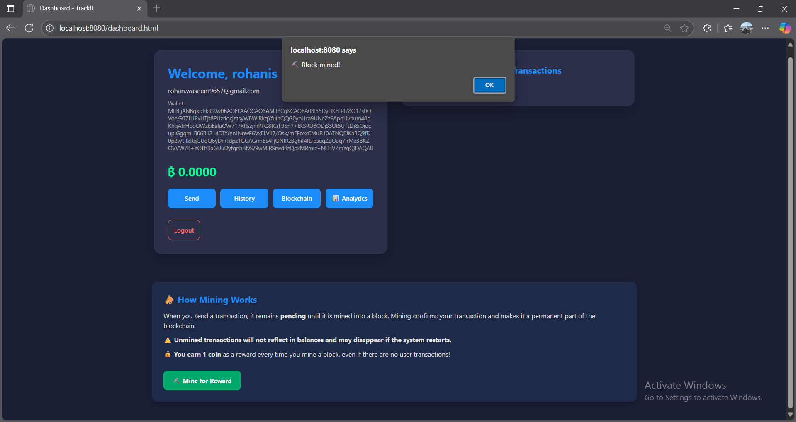
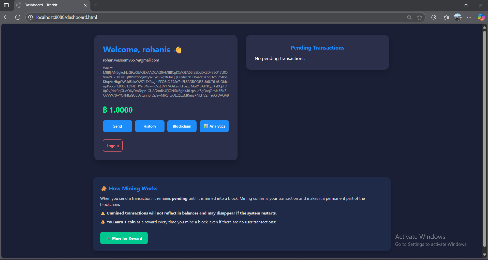
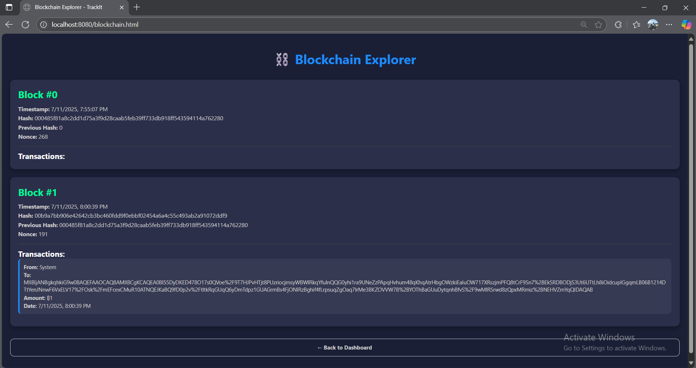
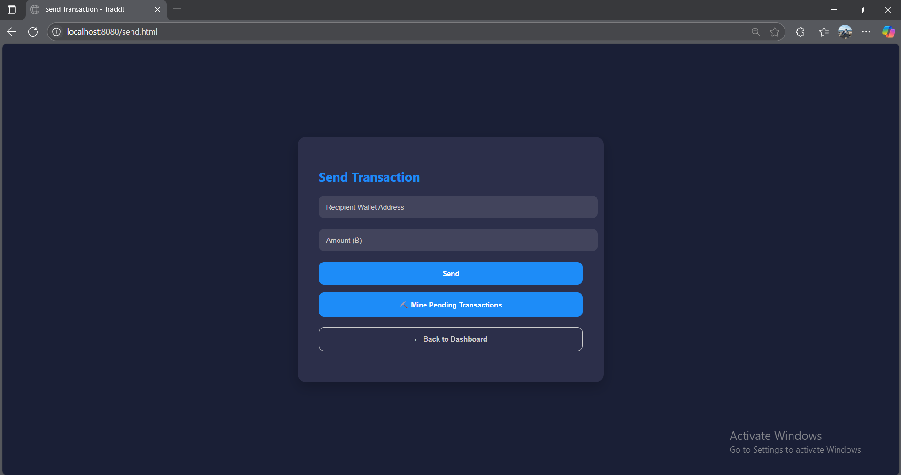
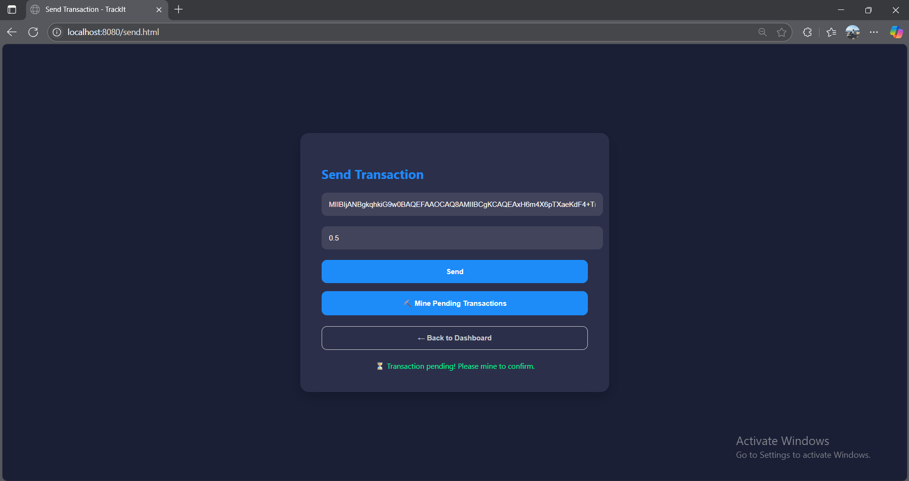
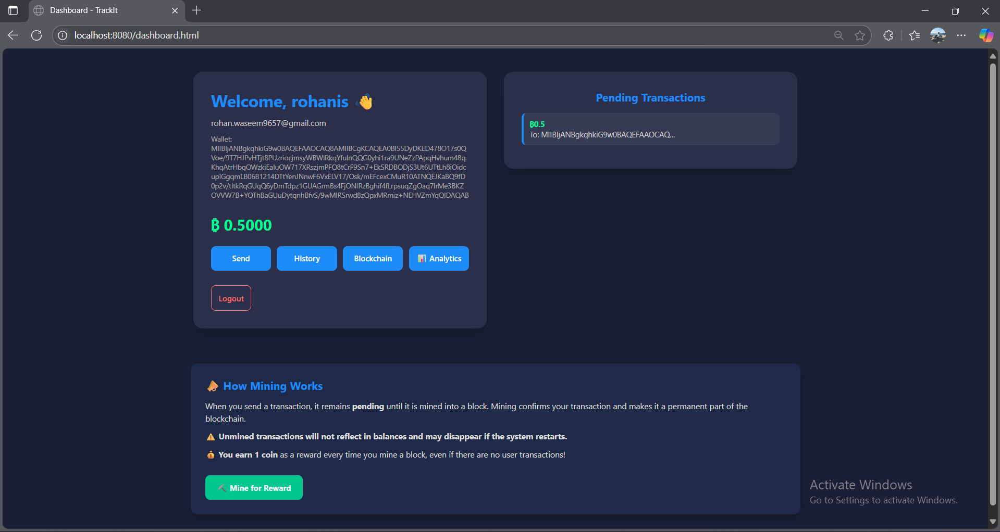
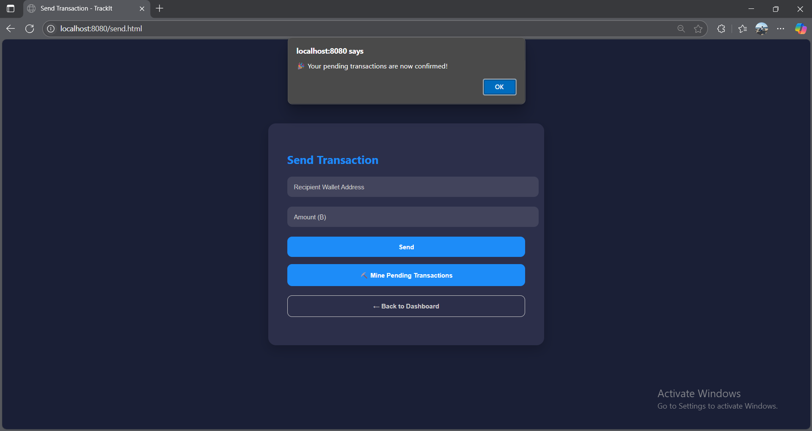
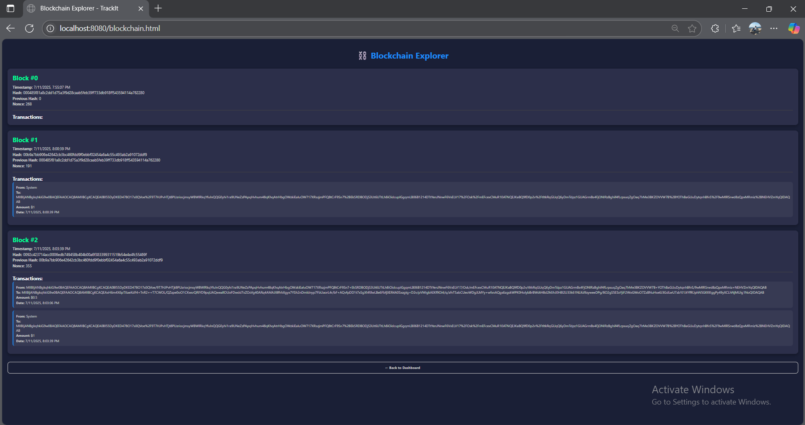
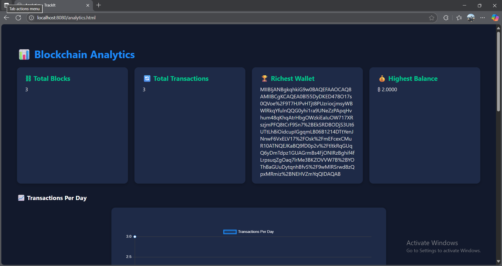
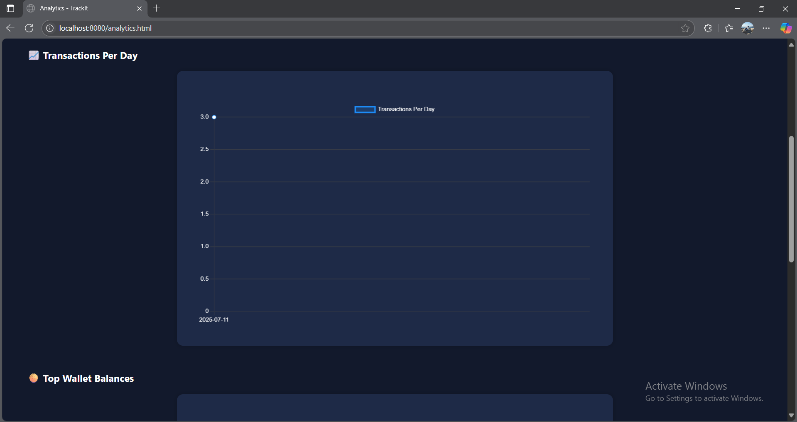
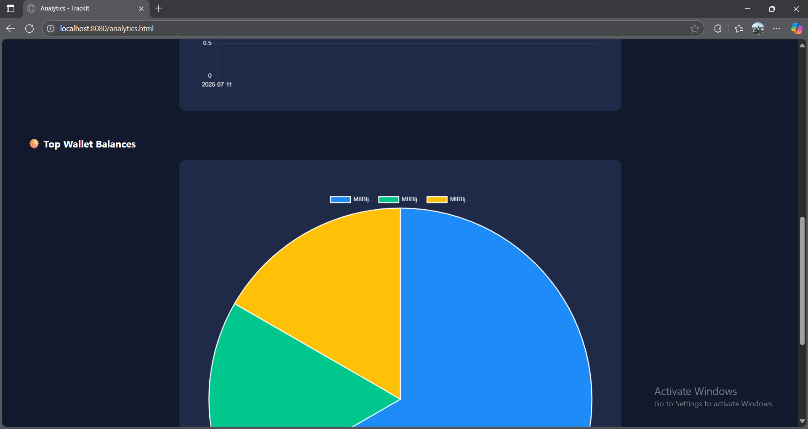
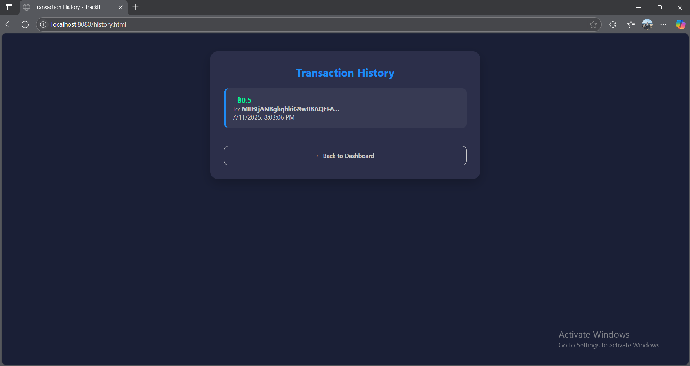
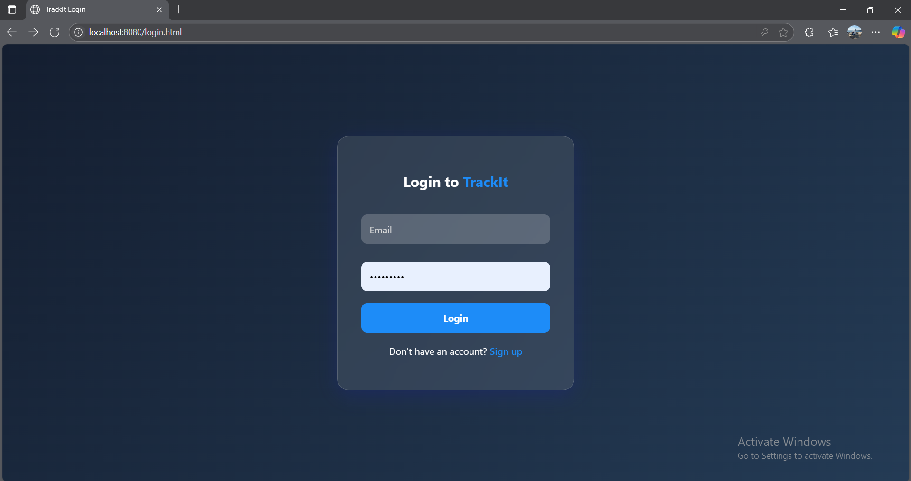
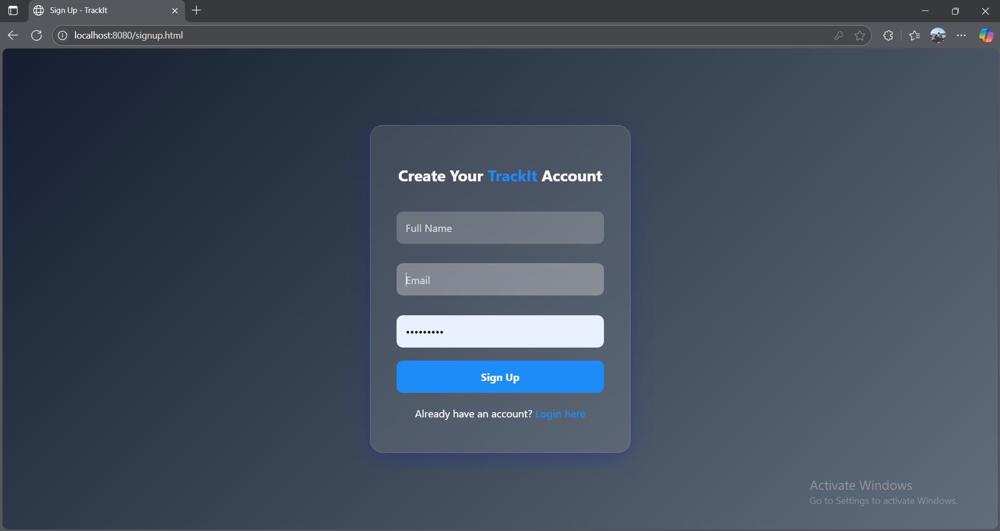
